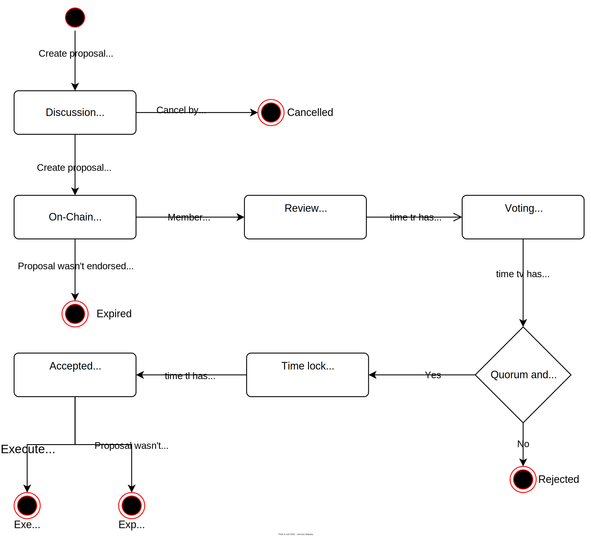

---
---

# Proposals

## What is a Proposal?

A proposal is an instrument with which anyone can suggest on-chain changes by invocation of one or more smart contract
methods. 
Technically speaking, a proposal is a set of method calls on smart contracts, each with a set of parameters. If the
proposal gets approved and executed, the smart contract methods are called with the defined params. The method calls
happen in the order they are defined in the proposal.

The method calls of a propsal are called **intents**. I.e., a proposal can consist of one or more intents.

## Proposal Life Cycle

The following image depicts the states a proposal passes through in its life cycle. Each state is further described
below in the [Proposal States](#proposal-states) section.

Note, that the time periods $t_r$, $t_v$, $t_l$, and $t_e$ are all parameters that can be changed via proposals. Thus,
the time it takes for a proposal to go from submission to execution depends on these parameters. Initially the voting
period is set to 7 days and the time lock to 3 days, so, a proposal can theoretically pass throgh the whole process in
10 days. In practice, this is not going to happen because of the time spent on proposal discussion before the voting
starts.

### Proposal States

**Discussion**  
The proposal was created through the GrantShares web app and is open for discussion. The discussion takes place on 
GitHub. An issue is automatically created for the proposal by the GrantShares backend. The proposal is not yet on-chain.
The proposer did not have to spend anygas so far.

**Cancelled**  
The proposal was cancelled by the proposer before it was put on-chain. The corresponding GitHub issue is closed by the
backend. In the future we might add a timeout that closes proposals that are not on-chain and inactive for a long time. 

**On-Chain**  
A proposal under discussion is created on the Neo blockchain, i.e., on the GrantShares contracts. At this point, the
proposal has to wait for the endorsement of a member before the rest of its life cycle begins.

**Expired**  
If the proposal is on-chain but isn't endorsed for a configuratble time period it expires. The period is defined by a
parameter on the smart contracts. After it is expired it can no longer be endorsed and becomes useless. The
corresponding GitHub issue is closed by the backend.

**Review**  
The first phase of a proposal on-chain is the review phase. It is meant as a buffer for forming an opintion before
active voting begins. Voting is not possible in this phase. But, because discussion on a proposal already takes place
before it is created on-chain this phase will initially be set to zero length. If deemed useful it can be activated and
used in the future.

**Voting**  
The proposal is open for voting by the members. The length of this phase is determined by a configurable parameter on
the contracts.

**Rejected**  
If, after voting period, the proposal didn't reach the quorum or the necessary yes votes it goes into the *Rejected*
state.

**Time lock**  
If the proposal was approved it goes into a time lock state before it can be executed. This phase exists for security.
If it turns out that the proposal poses a threat to the DAO, the GrantShares members could still react in this period
and pause the contracts to avoid any financial damage. The length of this phase is determined by a configurable
parameter on the contracts.

**Accepted**  
After the time lock phase the proposal reaches the *Accepted* state and is ready for execution. Execution requires an
external invocation. I.e., the proposer can invoce their proposal and thereby execute its intents.

**Expired**  
If the proposal isn't executed for a defined time period it expires. The period is defined by a contract parameter.
After it is expired it can no longer be executed even if it was accepted. This is a security measure, with the rational
that a proposal created in the past could possibly be a threat sometime in the future.  The length of this phase is
determined by a configurable parameter on the contracts.

**Executed**  
Once executed, the proposal has reached the end of its lifecycle.
